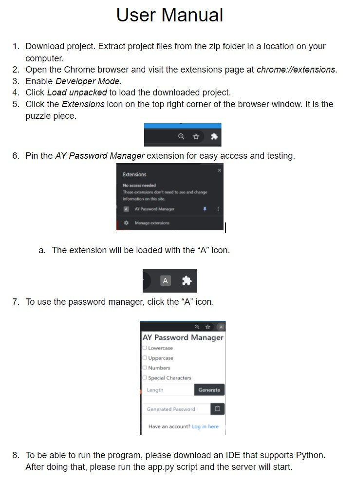
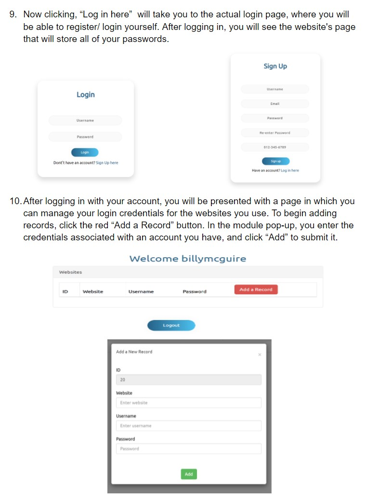
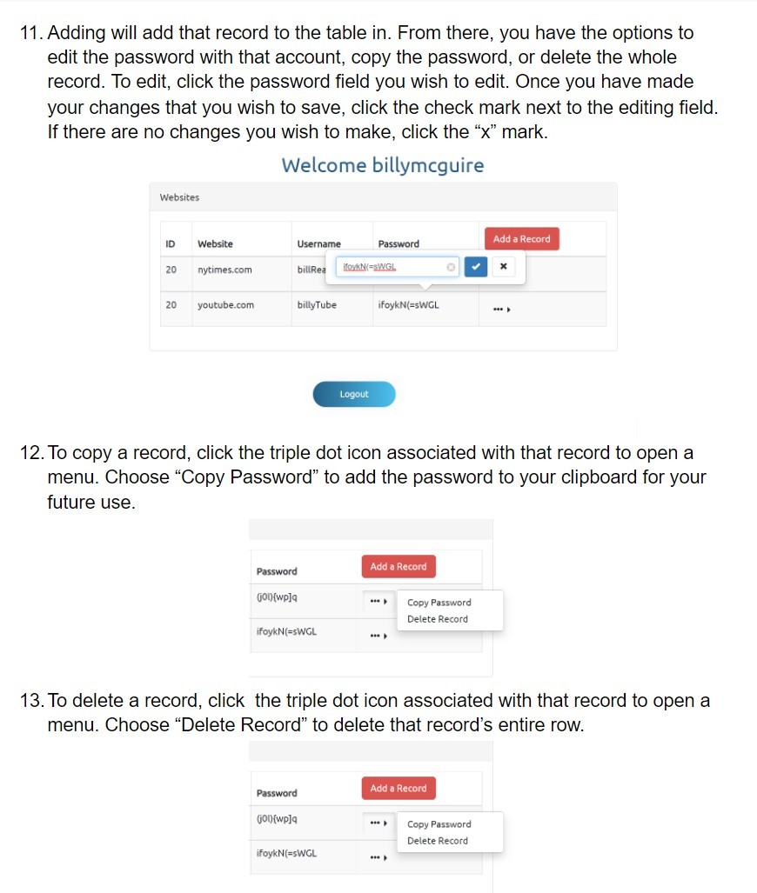

# AYPasswordManager

<h3>Authors: Yael Weiss & Akmal Muminov </h3>
<h2>General Description</h3>

The goal of the project is to create a password management platform in which users can store generated passwords to the websites they use. Password managers are programs that remember passwords for you, along with other identifiers like emails that help you login into an account. They also help you track which services you use, helping you identify which services go unused. Services are the websites the user uses and wishes to save their corresponding login credentials to. On top of the platform, there will be a Google Chrome Extension that will generate the passwords according to the password length and character restrictions specified by the user.
For security, the passwords are going to be encrypted before being placed in the database, and when the user needs to view them, they get decrypted and shown to the user. 

The structure of our application is the following:

<ul>
  <li>Backend written in Python/Flask</li>
  <li>Frontend - HTML/CSS/JS/JQuery</li>
  <li>Chrome extension - JS</li>
  <li>Database - MySQL + AWS hosted</li>
</ul>

<h2>User Manual</h2>

  
  
  

